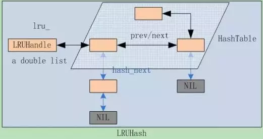

## structure

1. single thread

`Write(key, value)` -> `memory table(skiplist)` -> `Immutable memory table` -> `Disk Table`

2. multi thread
thread safe

## coding

using little-endian format

## slice

## LRU Cache

value: [Slice, * value]

double linked list, final point to NULL

Resize after exceed length

## LSM tree(skiplist)

